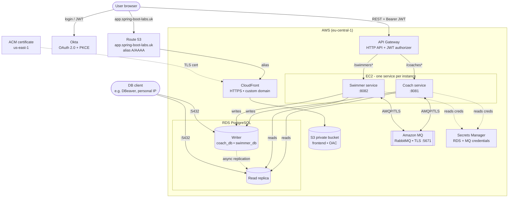
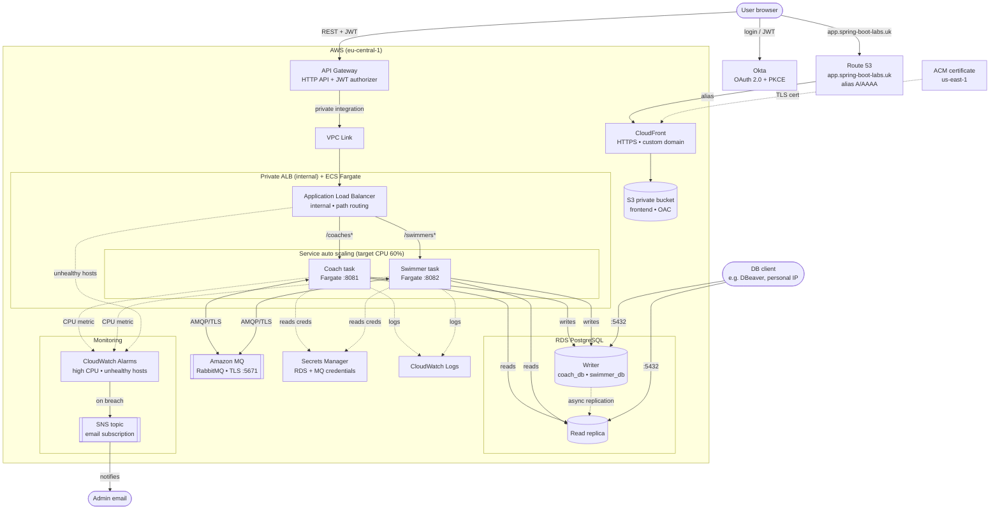

## Introduction

I started developing this project during laboratories on my studies but then I have developed it by myself.
Its assumption is that we have coaches and swimmers - every swimmer can have one coach, but coaches can have
many swimmers. In connection with this we have two microservices. They publish REST API that enables different
operations on coaches and swimmers. Apart from that I implemented a frontend (JS, CSS and HTML) and an API
gateway. Each component is dockerized including two PostgreSQL database servers for microservices.
The communication between coach and swimmer services is handled asynchronously and synchronously via RabbitMQ.
I also implemented authentication and authorization using Okta, and provided a CI/CD pipeline using GitHub Actions.
The project can be run in two ways: **locally** with Docker Compose (as originally designed) and on **AWS**, where the
whole infrastructure is defined as code with **AWS CDK in Kotlin**. The AWS deployment comes in **two independent
ways** - an **EC2-based** stack (`SpringBootLabsEc2Stack`, one service per instance) and an **ECS/Fargate-based**
stack (`SpringBootLabsEcsStack`, serverless containers behind a private load balancer). Both share the same supporting
services (API Gateway, Amazon MQ, RDS PostgreSQL with a read replica, S3 + CloudFront behind a custom domain, and
Secrets Manager). The frontend is served over HTTPS from a custom domain (`app.spring-boot-labs.uk`) managed with
Route 53 and an ACM certificate.

## Technology Stack

| Layer          | Technology                                                          |
|----------------|---------------------------------------------------------------------|
| Language       | Java 21                                                             |
| Framework      | Spring Boot 3.5, Spring Security, Spring Data JPA, Spring AMQP     |
| API Gateway    | AWS API Gateway (HTTP API + JWT authorizer) in the cloud; Spring Cloud Gateway (WebFlux) for local dev |
| Messaging      | RabbitMQ / Amazon MQ (JSON messages via `Jackson2JsonMessageConverter`) |
| Databases      | PostgreSQL / Amazon RDS PostgreSQL (writer + read replica), H2 (coach tests) |
| Auth           | Okta (OAuth 2.0 + PKCE, JWT resource server)                       |
| Frontend       | Vanilla JavaScript, HTML, CSS, Okta Auth JS SDK (served via S3 + CloudFront in the cloud) |
| DNS & TLS      | Route 53 (delegated subdomain) + ACM certificate - custom domain `app.spring-boot-labs.uk` (HTTPS on CloudFront) |
| Containerization | Docker, Docker Compose                                            |
| Cloud          | AWS - EC2 **or** ECS/Fargate, API Gateway, Amazon MQ, RDS PostgreSQL (+ read replica), S3 + CloudFront, Secrets Manager, CloudWatch Logs |
| Monitoring     | CloudWatch alarms (high CPU, unhealthy hosts) with email notifications via SNS |
| IaC            | AWS CDK (Kotlin, Gradle)                                            |
| CI/CD          | GitHub Actions                                                      |
| Testing        | TestNG, Testcontainers (PostgreSQL, RabbitMQ), Awaitility, MockMvc  |

## Architecture Diagram

The project can be run in two ways - **locally** with Docker Compose (the original setup) and **on AWS**, provisioned
with CDK. The AWS side has **two independent stacks** (deployed one at a time): an **EC2-based** one and an
**ECS/Fargate-based** one. All three are shown below.

### Local (Docker Compose)

```
                                ┌──────────┐
                                │   Okta   │
                                │(OAuth 2.0│
                                │ + PKCE)  │
                                └────┬─────┘
                                     │ 
                                     │
┌──────────┐    JWTs (Bearer)   ┌────▼─────┐
│ Frontend │───────────────────►│ Gateway  │
│ (httpd)  │                    │ (WebFlux)│
└──────────┘                    └────┬─────┘
                                     │
                        ┌────────────┴────────────┐
                        │                         │
                        ▼                         ▼
             ┌──────────────┐          ┌──────────────┐
             │    Coach     │          │   Swimmer    │
             │   Service    │          │   Service    │
             └───┬──────┬───┘          └───┬──────┬───┘
                 │      │                  │      │
                 │      │  ┌───────────┐   │      │
                 │      └─►│ RabbitMQ  │◄──┘      │
                 │         │           │          │
                 │         │ Queues:   │          │
                 │         │ • delete. │          │
                 │         │   coach   │          │
                 │         │ • get.    │          │
                 │         │   coach.  │          │
                 │         │   swimmers│          │
                 │         └───────────┘          │
                 │                                │
             ┌───▼─────────┐         ┌────────────▼──┐
             │  PostgreSQL │         │   PostgreSQL  │
             │  (coach_db) │         │  (swimmer_db) │
             └─────────────┘         └───────────────┘
```

### AWS - EC2 stack (`SpringBootLabsEc2Stack`)



### AWS - ECS/Fargate stack (`SpringBootLabsEcsStack`)

Same supporting services as the EC2 stack, but the two microservices run as **serverless Fargate tasks** behind an
**internal (private) Application Load Balancer**. The ALB is not reachable from the internet - API Gateway forwards
requests to it through a **VPC Link**, so the HTTP API stays the single public entry point. The ALB does the
path-based routing (`/coaches*`, `/swimmers*`) and health checks each task on `/actuator/health`; container logs go
to **CloudWatch Logs**.



**Writer / reader split (RDS read replica):** each service holds two datasources routed by a
`TransactionRoutingDataSource`. Methods annotated `@Transactional(readOnly = true)` are sent to the **read replica**,
while write transactions go to the **writer** - a poor man's simulation of what Aurora provides out of the box.
Replication is asynchronous (streaming WAL), so the replica can lag slightly behind the writer.

**Coach → Swimmer communication via RabbitMQ:**
- **`delete.coach.queue`** - when a coach is deleted, the coach service publishes a `DeleteCoachEvent` (asynchronous, fire-and-forget). The swimmer service consumes it and unassigns all swimmers from that coach.
- **`get.coach.swimmers.queue`** - when requesting swimmers of a coach, the coach service publishes a `GetCoachSwimmersRequest` and synchronously waits for the response (request-response pattern via `convertSendAndReceiveAsType`).

### Custom domain & HTTPS (Route 53 + ACM)

The CloudFront frontend is served from a **custom domain - `app.spring-boot-labs.uk`** - over HTTPS, instead of the
default random `*.cloudfront.net` address. This applies to **both stacks** (they share the same `StaticSiteConstruct`).

**Why it matters:**
- A stable, human-friendly URL that **does not change between deployments** - so the Okta sign-in / sign-out redirect
  URIs and CORS origin are configured once and never need updating after a redeploy.
- HTTPS with a certificate **issued for this domain**, so the browser shows a valid HTTPS lock icon (🔒) for `app.spring-boot-labs.uk`.

**How it is wired:**
- **DNS delegation** - the apex domain `spring-boot-labs.uk` is registered on Cloudflare (whose registrar locks the
  nameservers), so the subdomain `app.spring-boot-labs.uk` is **delegated** to a Route 53 hosted zone via `NS` records
  in Cloudflare. Route 53 is then authoritative for that subdomain and can manage the records and certificate
  validation automatically.
- **ACM certificate** - CloudFront requires its certificate in **us-east-1**, regardless of where the rest of the stack
  lives (`eu-central-1`). It therefore gets its **own stack, `SiteCertificateStack` (us-east-1)**, which issues an ACM
  certificate with **DNS validation** against the Route 53 hosted zone. The certificate is AWS-managed and **renews
  automatically** (the validation `CNAME` stays in Route 53). The ARN is shared with the main stack via
  **`crossRegionReferences`** (CDK bridges it across regions with an SSM parameter + a small custom resource).
- **Alias records** - Route 53 **A + AAAA alias** records (IPv4 + IPv6) at the zone apex point at the CloudFront
  distribution. Alias records work at the apex (unlike a `CNAME`) and are free to query.

Deployment is two-staged: first `SiteCertificateStack` (in `us-east-1`, which also bootstraps that region), then the
main stack (which CDK auto-includes the certificate stack as a cross-region dependency).

## Authentication & Authorization (Okta)

Authentication is configured using the **Okta Integrator Free Plan** with **OAuth 2.0 Authorization Code flow + PKCE**.
No client secret is used - PKCE (Proof Key for Code Exchange) is enabled to increase security, making it suitable
for public clients like the frontend.

**Token configuration:**
- **Access token** - valid for **5 minutes**
- **Refresh token** - valid for **10 minutes** (with `offline_access` scope)
- **Auto-renewal** - the Okta Auth JS SDK automatically renews the access token using the refresh token
- **Inactivity timeout** - after **10 minutes** of inactivity (refresh token expires), the user is automatically logged out

**Authorization:**
- JWT tokens carry a custom `role` claim (configured in Okta Authorization Server)
- The gateway and both microservices validate JWTs as OAuth2 resource servers
- Method-level security is enforced using `@PreAuthorize` - for example, deleting a coach requires the `admin` authority

**Logout:**
- Tokens are cleared from `localStorage` and the user is signed out of the Okta session via `oktaAuth.signOutOfOkta()`

## CI/CD Pipeline (GitHub Actions)

The CI/CD pipeline is defined in `.github/workflows/ci.yml`.

**CI - runs on every push to any branch:**
- **`build-coach`** - `mvn verify` (compiles + runs integration tests)
- **`build-swimmer`** - `mvn verify` (compiles + runs integration tests)
- **`build-gateway`** - `mvn package` (compiles only, no tests)

All three build jobs run **in parallel**.

**CD - runs only on push to `master`:**
- **`docker`** - after all build jobs pass, Docker images are built and pushed to Docker Hub for: `coach`, `swimmer`, `gateway`, `frontend`

## Integration Tests

Integration tests use **TestNG** with **Testcontainers** to spin up real PostgreSQL and RabbitMQ containers.

**Test infrastructure:**
- `RabbitMqTestContainer` - starts a RabbitMQ container and exposes a connection factory
- `PostgreSqlTestContainer` - starts a PostgreSQL container initialized with `init.sql`
- `IntegrationTestConfiguration` - base class that extends `AbstractTestNGSpringContextTests`, starts containers, declares queues, and overrides Spring properties via `@DynamicPropertySource`

**Test classes (named `*IT` for failsafe plugin):**
- **swimmer service:**
    - `PostMethodTestIT` - tests CRUD operations via MockMvc
    - `CoachConsumerTestIT` - tests RabbitMQ consumers (delete coach event, get coach swimmers request)
- **coach service:**
    - `PostMethodTestIT` - tests coach creation, deletion (with `admin` role), and verifies that `DeleteCoachEvent` is published to RabbitMQ. Also includes a negative security test (DELETE with `user` role returns 403)

**Running integration tests locally:**
```bash
# swimmer service (requires Docker running for Testcontainers)
mvn verify --file swimmer/pom.xml

# coach service (requires Docker running for Testcontainers)
mvn verify --file coach/pom.xml
```

> **Note:** Docker must be running locally because Testcontainers starts real PostgreSQL and RabbitMQ containers during the tests.

## How to Run

### Run locally (Docker Compose)

#### Prerequisites
- Docker and Docker Compose

#### Start the application

```bash
cd docker
docker-compose up --build -d
```

This starts all services:

| Service             | URL                    |
|---------------------|------------------------|
| Frontend            | http://localhost:8083   |
| Gateway             | http://localhost:8080   |
| Coach service       | http://localhost:8081   |
| Swimmer service     | http://localhost:8082   |
| RabbitMQ Management | http://localhost:15672  |

#### Stop the application

```bash
cd docker
docker-compose down
```

### Run on AWS

The cloud deployment is fully managed by CDK - see the [Infrastructure](#infrastructure) section for the
prerequisites and the deploy script. Pick **one** of the two stacks (they are deployed one at a time, never together):

```bash
cd infrastructure
./cdk-deploy-manual.sh -d SpringBootLabsEc2Stack     # EC2 variant
# or
./cdk-deploy-manual.sh -d SpringBootLabsEcsStack     # ECS/Fargate variant
```

After the deployment finishes, CDK prints two stack outputs:

| Output        | Meaning                                             |
|---------------|-----------------------------------------------------|
| `ApiEndpoint` | Base URL of the HTTP API (API Gateway)              |
| `ClientUrl`   | Public HTTPS URL of the CloudFront-hosted frontend  |

> The API Gateway URL is injected into the frontend automatically at deploy time, so no manual edit of
> `configuration.js` is needed.

#### View the service logs

**EC2 stack** - each service runs as a single Docker container (named `coach` / `swimmer`) on its own EC2 instance.
Connect to an instance via **EC2 Instance Connect** (the "Connect" button in the EC2 console) or SSH (port 22 is
open), then:

```bash
sudo docker logs -f coach      # on the coach instance
sudo docker logs -f swimmer    # on the swimmer instance
```

**ECS stack** - the Fargate tasks stream their logs to **CloudWatch Logs** (retention: one week). The log groups
are auto-named by CDK, so the easiest way is the CloudWatch console → *Log groups* (stream prefixes are `coach` /
`swimmer`).

The routing datasource logs `Setting writer (read-write) datasource` / `Setting replica (read-only) datasource`,
so these logs are also the easiest way to confirm the writer/reader split is working.

#### Connect to RDS (writer & read replica) with a database client

Both the writer and the replica are publicly reachable, but the RDS security group only allows port `5432` from
the `PERSONAL_INGRESS_CIDR` range (`165.1.145.0/24`) - update that constant if your public IP changes.

1. Find the endpoints (writer identifier `spring-boot-labs-postgre-sql`, replica `…-postgre-sql-replica`).
2. Fetch the master credentials (the replica inherits the same ones from Secrets Manager).
3. In any database client (e.g. DBeaver) create a PostgreSQL connection:

   | Field    | Value                                  |
   |----------|----------------------------------------|
   | Host     | writer or replica endpoint from step 1 |
   | Port     | `5432`                                 |
   | Database | `coach_db`, `swimmer_db` or `postgres` |
   | User     | `username` from the secret             |
   | Password | `password` from the secret             |

4. To confirm which node you are on, run `SELECT pg_is_in_recovery();` - it returns `true` on the **read replica**
   (read-only recovery mode) and `false` on the **writer**.

#### Tear down (cost)

Amazon MQ and the second RDS instance (the read replica) are the dominant costs, so remove the stack when you are
done testing (use whichever stack you deployed):

```bash
./cdk-deploy-manual.sh -r SpringBootLabsEc2Stack     # or SpringBootLabsEcsStack
```

## Infrastructure

The whole cloud infrastructure is defined as code with **AWS CDK in Kotlin** (Gradle) under the `infrastructure`
directory. It comes in two independent stacks that share the same supporting services (an HTTP API Gateway, Amazon MQ
(RabbitMQ), an RDS PostgreSQL writer with a read replica, an S3 + CloudFront static frontend behind a custom domain and
the Secrets Manager secrets) but differ in **how the two microservices are run**: one on plain EC2 instances (one per
service), the other as ECS/Fargate tasks behind a private load balancer. Everything lives in the default VPC of a single
personal AWS account (region `eu-central-1`), except the CloudFront ACM certificate which must live in `us-east-1`.

### Prerequisites

- Java 21
- `npm i -g aws-cdk`
- Use the `.nvmrc` file to set the Node.js version (`nvm use`)
- A configured AWS CLI profile (default `personal-aws`): `aws configure --profile personal-aws`

### Stacks

Only one stack is deployed at a time - they intentionally reuse the same resource names (RDS identifier, MQ broker,
security groups), so deploying both simultaneously would clash. Remove one before deploying the other.

- **`SpringBootLabsEc2Stack`** - runs each service as a single Docker container on its **own EC2 instance**. It creates
  the two EC2 instances (coach, swimmer) with their security groups and instance role, the RDS PostgreSQL writer plus
  its read replica, the Amazon MQ broker, the HTTP API Gateway (JWT authorizer backed by Okta) pointing at the
  instances, the S3 + CloudFront frontend, and the Secrets Manager secrets.

- **`SpringBootLabsEcsStack`** - runs the services as **serverless ECS/Fargate tasks** behind an **internal
  (private) Application Load Balancer**. API Gateway reaches the ALB through a **VPC Link** (the ALB is not public);
  the ALB does path-based routing and health checks tasks on `/actuator/health`. Task logs stream to **CloudWatch
  Logs**. The rest (RDS writer + replica, Amazon MQ, S3 + CloudFront, Secrets Manager) is the same as the EC2 stack.

Both stacks inject the API Gateway URL into the frontend at deploy time and export the `ApiEndpoint` and `ClientUrl`
outputs.

- **`SiteCertificateStack`** (in **`us-east-1`**) - a small dedicated stack that issues the **ACM certificate** for the
  custom domain `app.spring-boot-labs.uk`, DNS-validated against the delegated Route 53 hosted zone. CloudFront requires
  its certificate in `us-east-1`, so it is kept separate and shared with whichever main stack is deployed via
  `crossRegionReferences`. Deploy it first (targeting `us-east-1`); the main stack then references it automatically:

  ```bash
  ./cdk-deploy-manual.sh -d SiteCertificateStack us-east-1
  ./cdk-deploy-manual.sh -d SpringBootLabsEcsStack   # or SpringBootLabsEc2Stack
  ```

### Manual deployment

Move to the `infrastructure` directory and use the `cdk-deploy-manual.sh` script:

```bash
./cdk-deploy-manual.sh <action> <stack> [region] [profile]
```

Possible values:

- **action**:
    - deploy stack: `-d`, `deploy`
    - show difference: `-f`, `diff`
    - remove stack: `-r`, `remove`
- **stack**: `SpringBootLabsEc2Stack`, `SpringBootLabsEcsStack` or `SiteCertificateStack` (the us-east-1 ACM certificate stack)
- **region**: defaults to `eu-central-1` (use `us-east-1` for `SiteCertificateStack`)
- **profile**: defaults to `personal-aws`

Examples:

```bash
./cdk-deploy-manual.sh -d SpringBootLabsEc2Stack     # deploy the EC2 stack
./cdk-deploy-manual.sh -f SpringBootLabsEcsStack     # diff the ECS stack
./cdk-deploy-manual.sh -r SpringBootLabsEc2Stack     # remove the EC2 stack
./cdk-deploy-manual.sh -d SiteCertificateStack us-east-1   # deploy the ACM certificate stack (must be us-east-1)
```
