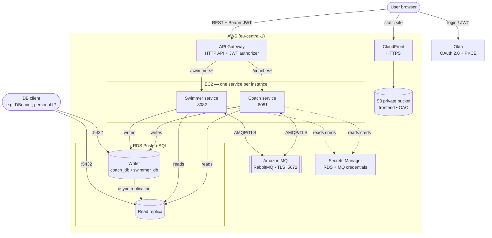

## Introduction

I started developing this project during laboratories on my studies but then I have developed it by myself.
Its assumption is that we have coaches and swimmers — every swimmer can have one coach, but coaches can have
many swimmers. In connection with this we have two microservices. They publish REST API that enables different
operations on coaches and swimmers. Apart from that I implemented a frontend (JS, CSS and HTML) and an API
gateway. Each component is dockerized including two PostgreSQL database servers for microservices.
The communication between coach and swimmer services is handled asynchronously and synchronously via RabbitMQ.
I also implemented authentication and authorization using Okta, and provided a CI/CD pipeline using GitHub Actions.
The project can be run in two ways: **locally** with Docker Compose (as originally designed) and on **AWS**, where the
whole infrastructure (EC2, API Gateway, Amazon MQ, RDS PostgreSQL with a read replica, S3 + CloudFront and Secrets
Manager) is defined as code with **AWS CDK in Kotlin**.

## Technology Stack

| Layer          | Technology                                                          |
|----------------|---------------------------------------------------------------------|
| Language       | Java 21                                                             |
| Framework      | Spring Boot 3.5, Spring Security, Spring Data JPA, Spring AMQP     |
| API Gateway    | AWS API Gateway (HTTP API + JWT authorizer) in the cloud; Spring Cloud Gateway (WebFlux) for local dev |
| Messaging      | RabbitMQ / Amazon MQ (JSON messages via `Jackson2JsonMessageConverter`) |
| Databases      | PostgreSQL / Amazon RDS PostgreSQL (writer + read replica), H2 (coach tests) |
| Auth           | Okta (OAuth 2.0 + PKCE, JWT resource server)                       |
| Frontend       | Vanilla JavaScript, HTML, CSS, Okta Auth JS SDK (served via S3 + CloudFront in the cloud) |
| Containerization | Docker, Docker Compose                                            |
| Cloud          | AWS — EC2, API Gateway, Amazon MQ, RDS PostgreSQL (+ read replica), S3 + CloudFront, Secrets Manager |
| IaC            | AWS CDK (Kotlin, Gradle)                                            |
| CI/CD          | GitHub Actions                                                      |
| Testing        | TestNG, Testcontainers (PostgreSQL, RabbitMQ), Awaitility, MockMvc  |

## Architecture Diagram

The project can be run in two ways — **locally** with Docker Compose (the original setup) and **on AWS**
(the target architecture, provisioned with CDK). Both are shown below.

### Local (Docker Compose)

```
                                ┌──────────┐
                                │   Okta   │
                                │(OAuth 2.0│
                                │ + PKCE)  │
                                └────┬─────┘
                                     │ 
                                     │
┌──────────┐    JWTs (Bearer)   ┌────▼─────┐
│ Frontend │───────────────────►│ Gateway  │
│ (httpd)  │                    │ (WebFlux)│
└──────────┘                    └────┬─────┘
                                     │
                        ┌────────────┴────────────┐
                        │                         │
                        ▼                         ▼
             ┌──────────────┐          ┌──────────────┐
             │    Coach     │          │   Swimmer    │
             │   Service    │          │   Service    │
             └───┬──────┬───┘          └───┬──────┬───┘
                 │      │                  │      │
                 │      │  ┌───────────┐   │      │
                 │      └─►│ RabbitMQ  │◄──┘      │
                 │         │           │          │
                 │         │ Queues:   │          │
                 │         │ • delete. │          │
                 │         │   coach   │          │
                 │         │ • get.    │          │
                 │         │   coach.  │          │
                 │         │   swimmers│          │
                 │         └───────────┘          │
                 │                                │
             ┌───▼─────────┐         ┌────────────▼──┐
             │  PostgreSQL │         │   PostgreSQL  │
             │  (coach_db) │         │  (swimmer_db) │
             └─────────────┘         └───────────────┘
```

### AWS



**Writer / reader split (RDS read replica):** each service holds two datasources routed by a
`TransactionRoutingDataSource`. Methods annotated `@Transactional(readOnly = true)` are sent to the **read replica**,
while write transactions go to the **writer** — a poor man's simulation of what Aurora provides out of the box.
Replication is asynchronous (streaming WAL), so the replica can lag slightly behind the writer.

**Coach → Swimmer communication via RabbitMQ:**
- **`delete.coach.queue`** — when a coach is deleted, the coach service publishes a `DeleteCoachEvent` (asynchronous, fire-and-forget). The swimmer service consumes it and unassigns all swimmers from that coach.
- **`get.coach.swimmers.queue`** — when requesting swimmers of a coach, the coach service publishes a `GetCoachSwimmersRequest` and synchronously waits for the response (request-response pattern via `convertSendAndReceiveAsType`).

## Authentication & Authorization (Okta)

Authentication is configured using the **Okta Integrator Free Plan** with **OAuth 2.0 Authorization Code flow + PKCE**.
No client secret is used — PKCE (Proof Key for Code Exchange) is enabled to increase security, making it suitable
for public clients like the frontend.

**Token configuration:**
- **Access token** — valid for **5 minutes**
- **Refresh token** — valid for **10 minutes** (with `offline_access` scope)
- **Auto-renewal** — the Okta Auth JS SDK automatically renews the access token using the refresh token
- **Inactivity timeout** — after **10 minutes** of inactivity (refresh token expires), the user is automatically logged out

**Authorization:**
- JWT tokens carry a custom `role` claim (configured in Okta Authorization Server)
- The gateway and both microservices validate JWTs as OAuth2 resource servers
- Method-level security is enforced using `@PreAuthorize` — for example, deleting a coach requires the `admin` authority

**Logout:**
- Tokens are cleared from `localStorage` and the user is signed out of the Okta session via `oktaAuth.signOutOfOkta()`

## CI/CD Pipeline (GitHub Actions)

The CI/CD pipeline is defined in `.github/workflows/ci.yml`.

**CI — runs on every push to any branch:**
- **`build-coach`** — `mvn verify` (compiles + runs integration tests)
- **`build-swimmer`** — `mvn verify` (compiles + runs integration tests)
- **`build-gateway`** — `mvn package` (compiles only, no tests)

All three build jobs run **in parallel**.

**CD — runs only on push to `master`:**
- **`docker`** — after all build jobs pass, Docker images are built and pushed to Docker Hub for: `coach`, `swimmer`, `gateway`, `frontend`

## Integration Tests

Integration tests use **TestNG** with **Testcontainers** to spin up real PostgreSQL and RabbitMQ containers.

**Test infrastructure:**
- `RabbitMqTestContainer` — starts a RabbitMQ container and exposes a connection factory
- `PostgreSqlTestContainer` — starts a PostgreSQL container initialized with `init.sql`
- `IntegrationTestConfiguration` — base class that extends `AbstractTestNGSpringContextTests`, starts containers, declares queues, and overrides Spring properties via `@DynamicPropertySource`

**Test classes (named `*IT` for failsafe plugin):**
- **swimmer service:**
    - `PostMethodTestIT` — tests CRUD operations via MockMvc
    - `CoachConsumerTestIT` — tests RabbitMQ consumers (delete coach event, get coach swimmers request)
- **coach service:**
    - `PostMethodTestIT` — tests coach creation, deletion (with `admin` role), and verifies that `DeleteCoachEvent` is published to RabbitMQ. Also includes a negative security test (DELETE with `user` role returns 403)

**Running integration tests locally:**
```bash
# swimmer service (requires Docker running for Testcontainers)
mvn verify --file swimmer/pom.xml

# coach service (requires Docker running for Testcontainers)
mvn verify --file coach/pom.xml
```

> **Note:** Docker must be running locally because Testcontainers starts real PostgreSQL and RabbitMQ containers during the tests.

## How to Run

### Run locally (Docker Compose)

#### Prerequisites
- Docker and Docker Compose

#### Start the application

```bash
cd docker
docker-compose up --build -d
```

This starts all services:

| Service             | URL                    |
|---------------------|------------------------|
| Frontend            | http://localhost:8083   |
| Gateway             | http://localhost:8080   |
| Coach service       | http://localhost:8081   |
| Swimmer service     | http://localhost:8082   |
| RabbitMQ Management | http://localhost:15672  |

#### Stop the application

```bash
cd docker
docker-compose down
```

### Run on AWS

The cloud deployment is fully managed by CDK — see the [Infrastructure](#infrastructure) section for the
prerequisites and the deploy script. In short:

```bash
cd infrastructure
./cdk-deploy-manual.sh -d SpringBootLabsStack
```

After the deployment finishes, CDK prints two stack outputs:

| Output        | Meaning                                             |
|---------------|-----------------------------------------------------|
| `ApiEndpoint` | Base URL of the HTTP API (API Gateway)              |
| `ClientUrl`   | Public HTTPS URL of the CloudFront-hosted frontend  |

> The API Gateway URL is injected into the frontend automatically at deploy time, so no manual edit of
> `configuration.js` is needed.

#### Update Okta with the new CloudFront domain (info for the developer)

> This step is only relevant if you are the one deploying the stack — it is not required to browse or run the project.

The CloudFront domain (`ClientUrl`) is regenerated every time the stack is recreated, so it has to be registered
in Okta after each fresh deployment. In the Okta admin console open your application and set both:

- **Sign-in redirect URI** → `https://<cloudfront-id>.cloudfront.net/index.html`
- **Sign-out redirect URI** → `https://<cloudfront-id>.cloudfront.net/index.html`

(replace `<cloudfront-id>` with the value from the `ClientUrl` output). Add a **Trusted Origin**
(`https://<cloudfront-id>.cloudfront.net`) only if a CORS error appears during token exchange or renewal.

#### View the service logs on EC2

Each service runs as a single Docker container (named `coach` / `swimmer`) on its own EC2 instance. Connect to an
instance via **EC2 Instance Connect** (the "Connect" button in the EC2 console) or SSH (port 22 is open), then:

```bash
sudo docker logs -f coach      # on the coach instance
sudo docker logs -f swimmer    # on the swimmer instance
```

The routing datasource logs `Setting writer (read-write) datasource` / `Setting replica (read-only) datasource`,
so these logs are also the easiest way to confirm the writer/reader split is working.

#### Connect to RDS (writer & read replica) with a database client

Both the writer and the replica are publicly reachable, but the RDS security group only allows port `5432` from
the `PERSONAL_INGRESS_CIDR` range (`165.1.145.0/24`) — update that constant if your public IP changes.

1. Find the endpoints (writer identifier `spring-boot-labs-postgre-sql`, replica `…-postgre-sql-replica`):

   ```bash
   source aws-creds.sh                     # sets the personal-aws profile + region
   aws rds describe-db-instances \
     --query "DBInstances[].{id:DBInstanceIdentifier,endpoint:Endpoint.Address,role:ReadReplicaSourceDBInstanceIdentifier}" \
     --output table
   ```

2. Fetch the master credentials (the replica inherits the same ones from Secrets Manager):

   ```bash
   aws secretsmanager get-secret-value \
     --secret-id <rds-secret-arn-or-name> \
     --query SecretString --output text | jq
   ```

3. In any database client (e.g. DBeaver) create a PostgreSQL connection:

   | Field    | Value                                             |
   |----------|---------------------------------------------------|
   | Host     | writer or replica endpoint from step 1            |
   | Port     | `5432`                                            |
   | Database | `coach_db`, `swimmer_db` or `postgres`            |
   | User     | `username` from the secret (`dbadmin`)            |
   | Password | `password` from the secret                        |

4. To confirm which node you are on, run `SELECT pg_is_in_recovery();` — it returns `true` on the **read replica**
   (read-only recovery mode) and `false` on the **writer**.

#### Tear down (cost)

Amazon MQ and the second RDS instance (the read replica) are the dominant costs, so remove the stack when you are
done testing:

```bash
./cdk-deploy-manual.sh -r SpringBootLabsStack
```

## Infrastructure

The whole cloud infrastructure is defined as code with **AWS CDK in Kotlin** (Gradle) under the `infrastructure`
directory. It provisions plain EC2 instances (one per service), an HTTP API Gateway, Amazon MQ (RabbitMQ), an RDS
PostgreSQL writer with a read replica, an S3 + CloudFront static frontend and the Secrets Manager secrets, all in
the default VPC of a single personal AWS account (region `eu-central-1`).

### Prerequisites

- Java 21
- `npm i -g aws-cdk`
- Use the `.nvmrc` file to set the Node.js version (`nvm use`)
- A configured AWS CLI profile (default `personal-aws`): `aws configure --profile personal-aws`

### AWS credentials

Source the helper script (do **not** execute it) so the exported variables stay in your shell:

```bash
source aws-creds.sh [profile] [region]      # defaults: personal-aws, eu-central-1
```

### Stacks

- **`SpringBootLabsStack`** — the single stack for the whole project. It creates the two EC2 instances (coach,
  swimmer) with their security groups and instance role, the RDS PostgreSQL writer plus its read replica, the
  Amazon MQ broker, the HTTP API Gateway (JWT authorizer backed by Okta), the S3 + CloudFront frontend, and the
  Secrets Manager secrets for the database and the broker. The API Gateway URL is injected into the frontend at
  deploy time, and the stack exports the `ApiEndpoint` and `ClientUrl` outputs.

### Manual deployment

Move to the `infrastructure` directory and use the `cdk-deploy-manual.sh` script:

```bash
./cdk-deploy-manual.sh <action> <stack> [region] [profile]
```

Possible values:

- **action**:
    - deploy stack: `-d`, `deploy`
    - show difference: `-f`, `diff`
    - remove stack: `-r`, `remove`
- **stack**: `SpringBootLabsStack`
- **region**: defaults to `eu-central-1`
- **profile**: defaults to `personal-aws`

Examples:

```bash
./cdk-deploy-manual.sh -d SpringBootLabsStack     # deploy
./cdk-deploy-manual.sh -f SpringBootLabsStack     # diff
./cdk-deploy-manual.sh -r SpringBootLabsStack     # remove
```

TODO:
- moze log retention do logow cloud watcha
- circuitBreaker
